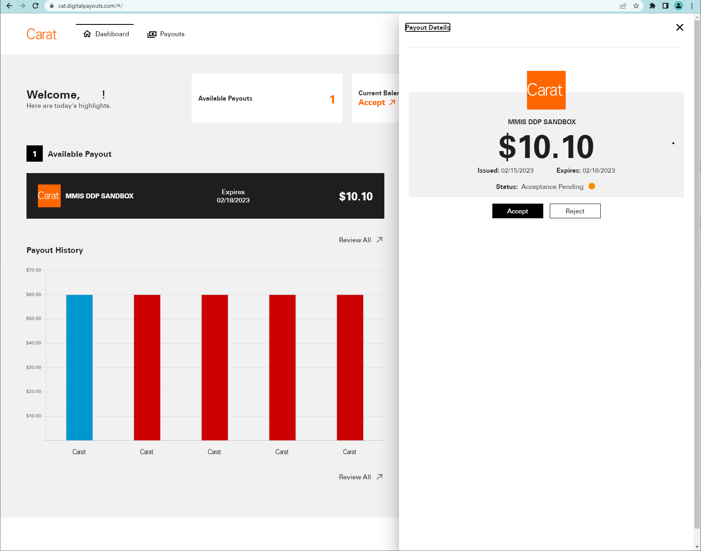

# Portal Flow

## Introduction

The Digital Disbursement (DDP) recipient portal offers a ready to use website where recipients can accept and manage their disbursements. The DDP Recipient Portal offers three paths a user can follow:

- **Guest Path**
  - This is the path every first time user will follow. After completing the first payout the guest user will be offered the ability to create an account. Additionally, a merchant has the option to enable  "Guest Flow Only" where users will not be prompted to create an account after completing a payout. Typically, the decision is based on the number of times that a consumer/business is expected to receive a payment.

- **Registered User Path**
  - If a recipient already has a registered account, they will be directed to a login screen. Once logged in recipients will be able to view, accept, reject, and track their payouts. see an example of a registered recipients dashboard for viewing and managing payouts below.

- **Multiple Recipient Payments**
  - If this option is being used, then the first recipient to enter his/her disbursement information will receive all of the funds.  The remaining recipients will have to approve the disbursement to the recipient receiving the funds prior to the completion of the disbursement.  If the payment expires before all recipients have approved or a recipient rejects the payment, then the payment is cancelled, funds are released in the DFA, and recipients are notified of the expiration.



## Pre-requisites

### Connectivity

The DDP services are accessed through the public Internet. DDP accepts communication only via the HTTPS channel.  Custom HTTP headers are also used carry additional information in each request.

| Environment       | Host                           | Base Path |
| ----------------  | ------------------------------ | --------- |
| Integration Test  | <https://int.api.firstdata.com>  | /ddp      |
| Pre-Production    | <https://cat.api.firstdata.com>  | /ddp      |
| Production        | <https://prod.api.firstdata.com> | /ddp      |

### Header Description

The header of Each API call will contain several parameters. It is important that each parameter contain the specified values to have a successful API Call. Any changes to the values will be noted through out the guide.

#### HTTP Headers

| Header Name       | Required      | Description |
| ----------------- | ------------- | ----------- |
| Api-Key           | Yes           | Merchant API key |
| Timestamp         | Yes           | Request initiation UTC timestamp, formatted as Epoch time. The value is in milliseconds. Sample value format is 1499961987232   |
| Authorization     | Yes           | Authorization header is required to have the "HMAC" string capitalized and followed by one space followed by the calculated HMAC signature. For request generated through Server: Authorization: "HMAC <signature>." |
| Client-Request-Id | Yes           | Contains a unique ID generated by the client that is used for enforcing idempotence on POST actions. |
| Content-Type      | Yes           | application/json |
| access token      | Conditionally | Required when vaulting payment information. Utilizes the tokenId returned from the /tokens api. |

#### Sample Header

```JSON
"Content-Type":"application/json"
"Client-Request-Id":"4da61bfb-6852-4f2a-9462-733276f633d7"
"Api-Key": "YMgw8VSrYMG6WTIUnoUUGv7hF9Aqh3EO"
"Authorization" : "HMAC W5X9NAlPgSNsfQX55fXbXrk3arzL6KxcCTA6SrnxL+U="
"Timestamp": "1607368688646"
```

#### How to generate HMAC Signature

HMAC signature is used in all calls made to our API and is necessary to receive a successful response from the system.

##### High Level Flow

- Get and save the current time
- Identify and save the request method
- Take the environment key and append a colon along with the current time
- Save this as the current raw signature (key:time)
- Get and save the payload from the request
- If the request method is not POST, move directly to step 7.
- Encrypt the request payload using SHA256 and save it
- Take this encrypted payload, make it a string and then encrypt it using Base64.
- Take the raw signature from step 4, append a colon and the Base64 encrypted payload to it and save it.
- Take the raw signature and HMAC encrypt it using SHA256 against the environment secret.
- Finally take this encrypted raw signature, make it a string and then encrypt it using Base64 to produce the signature for the header.

##### Example

JavaScript Example:

```javaScript

var key = postman.getEnvironmentVariable('clientKey');
var secret = postman.getEnvironmentVariable('clientSecret');
var time = new Date().getTime();
var method = request.method;
var rawSignature = key + ":" + time;
var requestBody = request.data;

if (method != 'GET' && method != 'DELETE') {
    var payload_digest = CryptoJS.SHA256(requestBody);
    var b64BodyContent = CryptoJS.enc.Base64.stringify(payload_digest);
    rawSignature = rawSignature + ":" + b64BodyContent;
}

var signature = CryptoJS.HmacSHA256(rawSignature, secret);
postman.setEnvironmentVariable('time', time);
postman.setEnvironmentVariable('signature', CryptoJS.enc.Base64.stringify(signature));

```

## Step 1: Initiate Payment

### Option 1a: Initiate Single Consumer Payment

Objective Merchant will want to initiate a payment for a single consumer recipient through the merchant portal and send email to recipient for the payment disbursement.

[](../api/?type=post&path=/ddp/v1/payments)

### Option 1b: Initiate Single Company Payment

Objective Merchant will want to initiate a payment for a single company recipient through the merchant portal and send email to recipient for the payment disbursement.

[](../api/?type=post&path=/ddp/v1/payments)

### Option 1c: Initiate Multi Consumer Payment

Objective Merchant will want to initiate a payment for a Multi consumer recipient through the merchant portal and send email to recipient for the payment disbursement.

[](../api/?type=post&path=/ddp/v1/payments)

### Option 1d: Initiate Multi Company Payment

Objective Merchant will want to initiate a payment for a Multi company recipient through the merchant portal and send email to recipient for the payment disbursement.

[](../api/?type=post&path=/ddp/v1/payments)

### Option 1e: Cancel a Payment

Merchant can only cancel payments that are in a “Pending” status. Once a disbursement method has been selected by the recipient, the payment is no longer able to be cancelled. After disbursement cancellation only applicable to ACH, Coinbase, E-check, Venmo and PayPal.

Clients are able to initiate a payment cancellation at any time during the process, unless the disbursement is being processed. When a cancellation is successful:

• The Transaction and Payment statuses are updated.

• The hold is removed from the funds in the DFA.

• Notification is sent to the recipient(s).

Using `merchantCustomerId`: This request can be used when you want to view all the transactions for that merchant customer id  

[](../api/?type=patch&path=/ddp/v1/payments/{merchantTransactionId}/cancel)

Using `merchantTransactionId`: This request to be used when you want to view the details of a particular transactions

[](../api/?type=patch&path=/ddp/v1/payments/{transactionId}/cancel)

## Step 2: Optional/Info: Get Merchant Info

This request will get the details of the onboard merchant with no request parameter only the headers are required. With this call you can get the full information of the merchant like ledger balance, Available balance, DFA Account Number, Merchant Name & Address details etc.

[](../api/?type=get&path=/ddp/v1/merchantInfo)

## See Also

- [Please refer our FAQ's](?path=docs/faq/faq.md)
