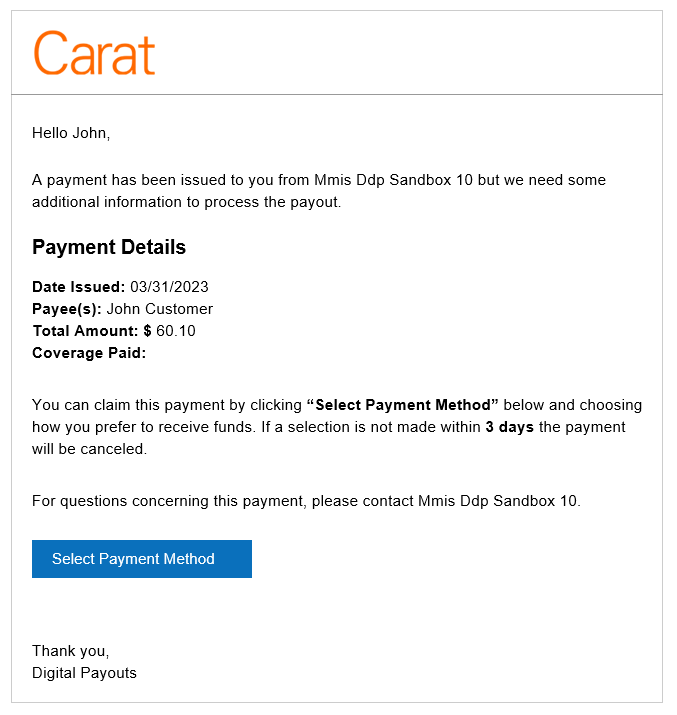

# Email Templates

DDP Offers the ability to send email notifications to recipients and to the merchant. This is done through HTML merging to generate emails based on templates. You can customize each notification or use one of our pre-made templates. Below you will find a list of events that will trigger email notifications and who (recipient or Client) they are intended for.

## Sample Email Template

This is an example of what the file email template will look like. You can customize the wording and some of the data fields. For more information on available customizations reach out to your account manager. If you do not have an account manger reach out to our [sales team](https://www.carat.fiserv.com/en-us/contact/?utm_campaign=payouts_content) to get started.

## Email Notification Table

| Feature Name | Recipient/ Client/ System | Description | Where Applicable? (Portal or Both (Portal+API)) |
| ------------ | ------------------------- | ----------- | ----------------------------------------------- |
|REMINDER_NOTIFICATION|Recipient|If set to yes, then a reminder email is sent to all recipients who have a pending payment. |Portal|
ENABLE_EMAIL_PROFILE_UPDATE|Recipient|Triggered when a change is made to the recipient profile.  This method should always be sent under the CARAT logo.|Portal|
|ENABLE_EMAIL_PROFILE_REGISTERED|Recipient|Triggered when a recipient successfully registers to the platform.   This method should always be sent under the CARAT logo.|Portal|
|ENABLE_EMAIL_PAYMENT_INITIATED|Recipient|Triggered when a payment is initiated by a client.  This message can utilize the client's logo and accept text changes.|Portal|
|ENABLE_EMAIL_ACH_SALE_REVERSAL|Recipient|Triggered when the ACH reversal process is successful|Both|
|ENABLE_EMAIL_ACH_CANCEL_SALE_REVERSAL|Recipient|Triggered when the ACH transaction is successfully cancelled.|Both|
|ENABLE_EMAIL_DISBURSEMENT_FAILED|Recipient|Triggered when a payment disbursement fails.   This message can utilize the client's logo and accept text changes.|Both|
|ENABLE_EMAIL_PAYMENT_CANCELLED|Recipient|Triggered when a merchant cancels a pending payment.  This message can utilize the client's logo and accept text changes.|Both|
|ENABLE_EMAIL_PAYMENT_REJECTED|Recipient|Triggered when a recipient rejects the payment.  This message can utilize the client's logo and accept text changes.|Both|
|ENABLE_EMAIL_PAYMENT_REMINDER|Recipient|Triggered when a payment has been in a pending status.  The first reminder is set to be sent 24 hours after the payment has been initiated.  This message can utilize the client's logo and accept text changes.|Both|
|ENABLE_EMAIL_PAYMENT_EXPIRED|Recipient|Triggered when a payment has expired and is no longer able to be disbursed.  This message can utilize the client's logo and accept text changes.|Both|
|ENABLE_EMAIL_PAYMENT_DISBURSED|Recipient|Triggered when a payment has been successfully disbursed.  This message can utilize the client's logo and accept text changes.|Both|
|ENABLE_EMAIL_ACH_CREDIT_REJECT|Recipient|Triggered when an ACH Disbursement is rejected.  This message can utilize the client's logo and accept text changes.|Both|
|ENABLE_DFA_BALANCE_EMAIL_ALERT|Client|Triggered when the DFA balance meets or drops below a set balance|Both|
|ENABLE_EMAIL_EMAIL_BOUNCED|Client|Send email if initialize email delivery failed to recipient(No need to setup this as we can never send email if delivery failed)|Both|
|ENABLE_EMAIL_FRAUD_HOLD|Client|Enable cancellation email to recipient when Fraud validation fails|Both|
|ENABLE_EMAIL_ACH_SALE_REVERSAL_FAILED|Client|Enable email when ACH payment reversal request failed|Both|
|ENABLE_EMAIL_PAYMENT_PROCESSING|Client|Enable email when Venmo/Paypal payment is disbursed.|Both|
|ENABLE_EMAIL_VENMO_CREDIT_REJECT|Client|Enable Cancellation email to recipient When payment is rejected by the payer(Venmo)|Both|
|ENABLE_EMAIL_VENMO_DISBURSEMENT_UNCLAIMED|Client|Email to recipient for unclaimed status|Both|
|ENABLE_EMAIL_VENMO_DISBURSEMENT_FAILED|Client|Email to recipient for Failed status|Both|
|ENABLE_EMAIL_VENMO_PAYPAL_PAYMENT_DISBURSE_HELD|Client|Enable email when Venmo/Paypal payment is Held.|Both|
|ENABLE_EMAIL_VENMO_REVERSAL_FAILED|Client|Used to enable email when venmo reversal failed|Both|
|ENABLE_EMAIL_VENMO_DISBURSEMENT_BLOCKED|Client|Enable email when Venmo/Paypal payment is Blocked.|Both|
|ENABLE_EMAIL_CHECK_DISBURSEMENT_PRINTED|Client|Email to recipient after receiving printed webhook from chekbook.io|Both|
|ENABLE_EMAIL_PAYMENT_ECHECK_DISBURSED|Client|Enable email when Echeck payment is disbursed.|Both|
|ENABLE_EMAIL_CHECK_REVERSAL_SUCCESS|Client|Enable email when Echeck Reversal success|Both|
|ENABLE_EMAIL_CHECK_REVERSAL_FAIL|Client|Enable email when Echeck Reversal Fail|Both|
|ENABLE_EMAIL_BATCH_ACKNOWLEDGEMENT|Client|Used to enable email for batch acknowledgment|Both|
|ENABLE_EMAIL_BATCH_SUMMARY|Client|Used to enable email for batch summary|Both|
|ENABLE_EMAIL_BATCH_ACKNOWLEDGEMENT_FILE_REJECTED|Client|This can be used to enable email for batch acknowledgment file rejected|Both|
|ENABLE_EMAIL_COINBASE_CANCEL_SALE_REVERSAL|Client|Triggered when the COINBASE transaction is successfully cancelled.|Both|
|ENABLE_EMAIL_COINBASE_SALE_REVERSAL|Client|Triggered when the COINBASE reversal process is successful|Both|
|ENABLE_EMAIL_COINBASE_SALE_REVERSAL_FAILED|Client|Triggered when the COINBASE reversal process has failed|Both|
|ENABLE_EMAIL_COINBASE_CREDIT_REJECT|Client|If set to yes, then an email is sent to all recipients when payment rejected.|Both|
